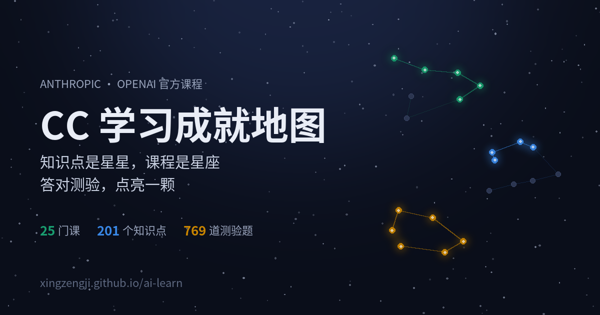

# ai-learn — CC 学习成就地图

一个产品经理（非技术背景）系统学习 Anthropic 与 OpenAI 官方 AI 课程的公开仓库，把整段学习旅程做成了一张可以玩的星空地图。

🌌 **在线地图：[xingzengji.github.io/ai-learn](https://xingzengji.github.io/ai-learn/)**

[](https://xingzengji.github.io/ai-learn/)

## 这是什么

**知识点是星星，课程是星座，实战项目是行星。** 学完一个知识点，点亮一颗星；整座星座点亮，这门课就完成了。

- **25 门课、201 个知识点、769 道测验题**：覆盖 [Anthropic Academy](https://anthropic.skilljar.com/) 的 22 门课和 [OpenAI Academy](https://academy.openai.com/) 的 3 门课，右上角一键切换（[OpenAI 版直达](https://xingzengji.github.io/ai-learn/?v=openai)）
- **答对才能点亮**：点开任意一颗星，先看知识点概要，再做 3–4 道单选题，全对才能点亮。题目选项每次乱序，背位置没用
- **任何人都能玩**：访客的点亮记录存在自己的浏览器里，不需要注册，不影响别人
- **分享我的星图**：一键生成专属链接，别人打开看到的就是你点亮的星空；也能生成一张竖版图片，发朋友圈、小红书
- **学习足迹**：底部同步作者的 GitHub 贡献热力图，每次学完提交一次，热力图就多一格

## 怎么用

**直接玩**：打开[在线地图](https://xingzengji.github.io/ai-learn/)，点任意一颗星开始答题。手机也能用。

**看笔记**：每门课的中文学习笔记在 [`Course/`](Course/) 下，按厂商分 `Claude/` 和 `Codex/` 两层；完整学习路线见 [`学习计划.md`](学习计划.md)。

**做一份你自己的地图**：见下方「Fork 指南」。

## Fork 指南：做一份你自己的学习地图

地图是纯静态网页，没有构建步骤、没有后端，fork 之后改几处就能用：

1. **Fork** 本仓库
2. 仓库 **Settings → Pages**，Source 选 `Deploy from a branch`，分支选 `main`、目录选 `/docs`，保存后几分钟就能在 `https://<你的用户名>.github.io/ai-learn/` 打开
3. 改 [`docs/index.html`](docs/index.html) 里的几处个人信息：
   - `<meta name="github-user">` 改成你的 GitHub 用户名（热力图读它）
   - `og:url`、`og:image` 两个分享卡片地址
   - 页脚的仓库链接
4. **清空进度**：把 [`docs/data/anthropic/progress.json`](docs/data/anthropic/progress.json) 和 [`docs/data/openai/progress.json`](docs/data/openai/progress.json) 里的 `courses`、`knowledge`、`projects` 都改成 `{}`
5. **正式点亮**：学完一个知识点，在 `progress.json` 里加一条，例如 `"k0101": { "status": "done", "date": "2026-10-04" }`，提交推送后地图和热力图一起更新。用 [Claude Code](https://claude.com/claude-code) 的话，直接说「点亮 k0101」即可，流程写在 [`CLAUDE.md`](CLAUDE.md)

课程、知识点、题库分别在 `docs/data/<厂商>/` 下的 `courses.json`、`knowledge.json`、`quiz.json`，想换成别的课程体系也是改这几个文件。改完运行 `python3 tools/check-data.py` 校验数据。

本地预览需要起一个服务器（直接双击 HTML 会读不到数据）：

```bash
python3 -m http.server 8000 -d docs   # 然后打开 http://localhost:8000
```

## 仓库结构

| 路径 | 内容 |
|---|---|
| `docs/` | 成就地图网页（GitHub Pages 直接发布），数据在 `docs/data/` |
| `Course/` | 课程中文笔记，按厂商分 `Claude/`、`Codex/` |
| `学习计划.md` | 22 门 Anthropic 课的中文速览、10 周安排、进度追踪 |
| `notes/` | 学习笔记（费曼输出法） |
| `practice/` | 实战项目的方案、需求与复盘 |
| `tools/` | 数据校验 `check-data.py`、网页冒烟测试 `e2e.js` |

## 关于课程笔记

课程笔记是学习过程中的中文译述与自写笔记，每篇开头注明了原课程、来源和许可。原课程采用 CC BY-NC-SA 4.0 许可的，中文译述作为改编作品同样以 CC BY-NC-SA 4.0 提供，并署名原作者。课程内容的版权归原作者所有，本仓库与 Anthropic、OpenAI 无隶属关系。
